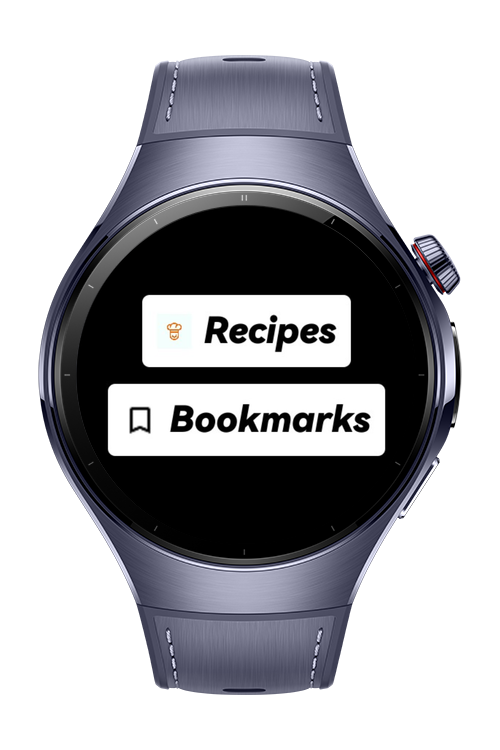
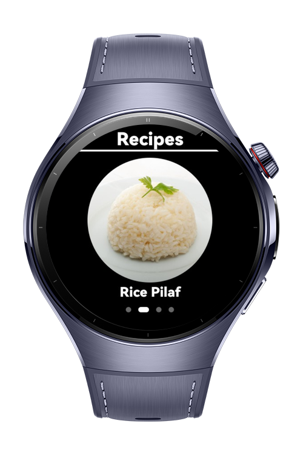
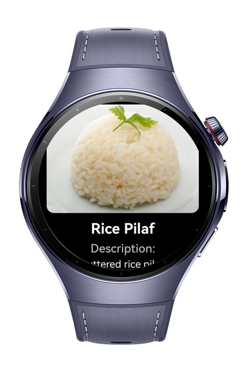

> **Note:** To access all shared projects, get information about environment setup, and view other guides, please visit [Explore-In-HMOS-Wearable Index](https://github.com/Explore-In-HMOS-Wearable/hmos-index).

# Food Recipe 
This app is a lightweight and intuitive recipe manager designed for HarmonyOS wearable devices using **ArkTS/ArkUI** for HarmonyOS. Users can explore delicious recipes, add them to favorites (bookmarks), and manage them locally using **RDB (Relational Database)**

# Preview
<div>
  
  
  
  
</div>

# Use Cases
- **Main Index Page**:  
  Offers two options — Bookmarks and Recipes.

- **Recipe Exploration**:  
  Selecting Recipes opens a swiper-based list. Users can view details and bookmark recipes.

- **Bookmark Management**:  
  Favorites displays all bookmarked recipes. Tapping on any allows the user to remove it.

# Technology
## Stack
- **Languages**: ArkTS/ArkUI
- **Frameworks**: HarmonyOS SDK 5.1.0.54
- **Tools**: DevEco Studio Vers 5.1.0.260
- **Libraries**:
  - `@kit.ArkUI`
  - `@ohos.data.rdb`  – Local relational database support (for storing favorites)
  - `@ohos.router`
  - `@ohos.app.ability`

## Required Permissions
- **ohos.permission.INTERNET**: Allows the app to fetch picture data from an endpoint.

# Directory Structure
```
entry/
└── ets/
    ├── component/
    │   └── RecipeCard.ets             # UI component for displaying individual recipes
    ├── constants/
    │   └── CommonConstantsDb.ets      # Constant values, especially for RDB usage
    ├── entryability/
    │   └── EntryAbility.ets           # Main app launcher
    ├── entrybackupability/
    │   └── EntryBackupAbility.ets     # Backup launch logic
    ├── model/
    │   ├── Recipe.ets
    │   └── RecipeParams.ets           # Params for navigating recipe pages
    ├── pages/
    │   ├── favorites/
    │   │   └── FavoritePage.ets       # Bookmarked recipes list
    │   └── recipes/
    │       ├── RecipesPage.ets        # Recipe list with swiper interface
    │       ├── DetailPage.ets         # Recipe detail view with add-to-bookmark
    │       └── Index.ets              # Main navigation page (Bookmarks & Recipes)
    ├── service/
    │   ├── FavoriteTable.ets          # RDB schema and operations for bookmarks
    │   └── Rdb.ets                     # Local database access and logic
    ├── util/
    │   └── Logger.ets                 # Logging utility
    └── viewmodel/
        ├── RecipesDetailViewModel.ets
        └── RecipesViewModel.ets       # ViewModels for state and UI logic

```

# Constraints and Restrictions
## Supported Device
- Huawei watch 5

# LICENSE
**Food Recipe** is distributed under the terms of the MIT License.
See the [LICENSE](/LICENSE) for more information.
